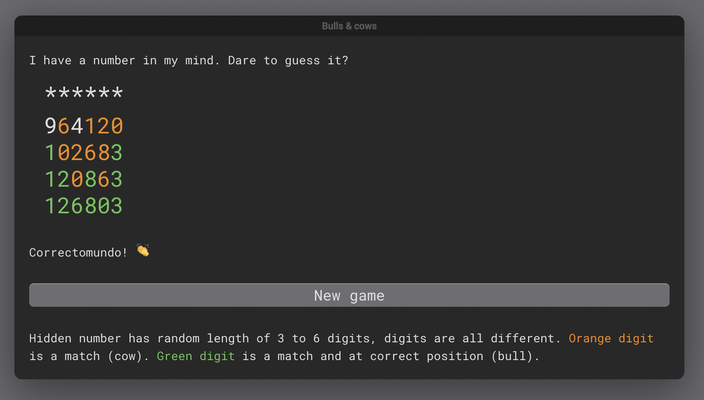

# Bulls & cows

Bulls and cows is a simple SPA application, based on the Wordle game, but with numbers. Or, you could say, Wordle was based on the original bulls and cows game, since its first computer versions appeared in the [1970s](https://en.wikipedia.org/wiki/Bulls_and_Cows).

The goal is to guess a randomly generated number from 3 to 6 digits. The player has a finite number of guess attempts (lives) which are represented as hearts. After each attempt game tells you if a digit is present (orange) or present and in the right spot (green).

I made it with react, and during the process, I learned more about arrays and array methods in javascript, regular expressions (used for input validation, so that the user can't type in anything but numbers), basic react hooks and deployment to GitHub pages.

## Demo

You are welcome to [play the game](https://arbuznik.github.io/bulls-and-cows/).